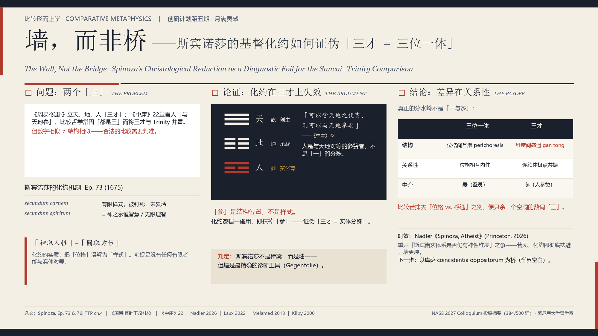

# 墙，而非桥：「一」不止一种

**Sancai × Trinity × Spinoza: A Study in Comparative Metaphysics**

创研计划第五期「月满灵感」参赛作品 ｜ 比较形而上学方向 ｜ 2026 年 9 月

> **「三」是一个充满陷阱的数词。问「是不是一」，不如问「是哪一种一」。**

---

## 一、这项研究回答什么

比较哲学里有一个几乎条件反射的动作：看到《周易》讲「天地人三才」，基督教讲「三位一体」，于是大手一挥——都是「三」，可以比。

本研究把这一步停下来，先问一句：**都是「三」，就真的是同一种「三」吗？**

结论是一句话：**这是一堵墙，不是一座桥。但正是这堵墙，告诉我们哪里才修得起桥。**

## 二、核心框架：「一」至少有四种逻辑形式

人类反复用「一」去统摄「多」，但至少存在四种**逻辑上互不相同**的「一多」结构，长期被混为一谈：

| 类型 | 代表 | 核心机制 | 三/多「真的」是一吗？ |
|---|---|---|---|
| **关联对应型** | 《周易》三才（天地人） | 结构性呼应，通过卦象对应，**无推导关系** | 否——三者各自独立，只是「对上」 |
| **必然蕴含型** | 斯宾诺莎 实体—样式 | 样式以几何必然性从实体「跟随」而出 | 是，但通过**严格蕴含**，而非同一性 |
| **实体同一型** | 不二论 梵—我 | 「tat tvam asi」字面同一，「多」是幻觉 | 是，通过**同一性**——「多」在究竟层面不真实 |
| **位格关系型** | 基督教 三位一体 | 三位格永恒真实相异，却共享同一本体 | 是，但**拒绝**把相异化约为幻觉 |

## 三、核心论证：斯宾诺莎是「墙」

斯宾诺莎把「一」推到最狠处：万物的存在与行动**不可能不是这样**——像三角形的内角和必然等于两直角（*Ethica* Ip17s）。

把三才放进这个框架，立刻出事：人不再是「结构中对等的一极」，而被降格成实体的一个分殊。但《中庸》第 22 章说得很清楚——**「可以赞天地之化育，则可以与天地参矣。」「参」是一个对等的位置，不是一个分殊。**

化约逻辑一旦用到三才上，就抹掉了「参」这个结构位——从而**证伪**了「三才＝实体的分殊」这条比较路径。墙，当场立起来。

## 四、真正的差异与真正的桥

- **真正的分水岭**不在「一还是多」，而在「这是**哪一种**一」：三位一体讲**位格**关系（互渗 perichoresis），三才讲**感通**（三极为同一转化过程的三个极点）。
- **最可能的桥是库萨（Nicolaus Cusanus）**：他的「对立面的统一」与「卷藏—展开」同《周易》通变、「理一分殊」存在结构性映射。真正还空着的问题是：**库萨的方案能否在保留「三位真实相异」的前提下运作？**——这正是它区别于、也可能优于不二论的关键考验点。

## 五、学术产出

本研究已凝成一篇英文投稿摘要（约 490 词，匿名评审）：

> **Not All "One-and-Many": Spinozist Necessitarianism as a Diagnostic for Comparative Monism**
> 投往北美斯宾诺莎学会（NASS）2027 年会（Vanderbilt University），colloquium 类型，截稿 2026-10-01。

按学术匿名评审规范，摘要全文在评审结束前不在本仓库公开。

## 六、仓库内容

| 文件 | 说明 |
|---|---|
| [三才三一论_创研计划第五期_研究报告.md](三才三一论_创研计划第五期_研究报告.md) | **完整研究报告**（含全部已核实参考文献与方法论声明） |
| [三才三一论_科研海报.png](三才三一论_科研海报.png) | 科研海报（16:9，学术展示用，见下方预览） |
| [三才三一论_科普长图.png](三才三一论_科普长图.png) | 科普向长图（外行可读版，见下方预览） |
| [三才三一论_科研海报.pptx](三才三一论_科研海报.pptx) | 海报源文件（PowerPoint 格式） |
| [LICENSE](LICENSE) | MIT 许可证 |

### 海报预览

### 科普长图预览

## 七、方法论声明

- 报告中所有标注【已核实】的文献均经**实时网络检索逐条确认**，未依赖模型记忆。
- 过程中纠正了两处流传的书目错误（例如 *Spinoza et le christianisme* 的作者是 Henri Laux 而非 Nadler），并按学界主流重构为一处表述加了限定语。
- 比较哲学方法论立场：**constructive comparison**（建构性比较）+ **asymmetric comparison**（非对称比较）；以 **Gegenfolie**（反衬）而非桥梁的方式使用斯宾诺莎。

## 八、许可证

本项目以 [MIT License](LICENSE) 发布。
